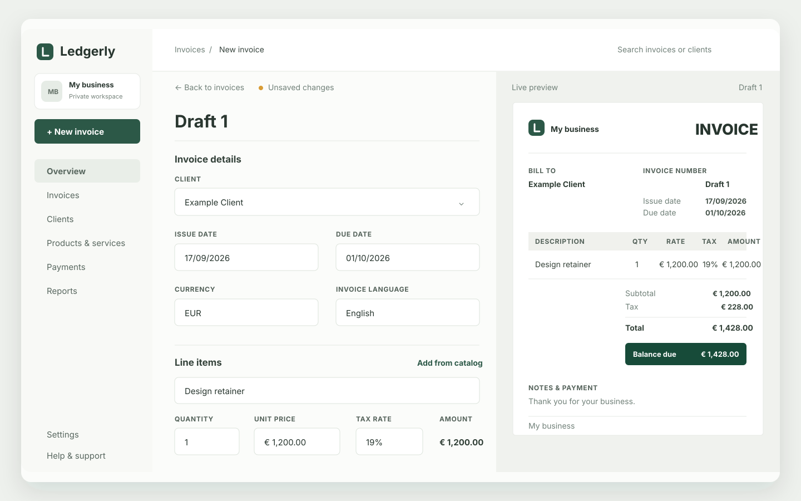

<p align="center">
  
</p>

<h1 align="center">Ledgerly</h1>

<p align="center">Local-first invoicing for independent businesses.</p>

<p align="center">
  Create polished invoices, stay on top of payments, and keep your records on your own device.
</p>

<p align="center">
  <a href="LICENSE">GPL-3.0-or-later</a> ·
  <a href="#get-started">Get started</a> ·
  <a href="CONTRIBUTING.md">Contribute</a>
</p>

<p align="center">
  
</p>

## Built for clear, local bookkeeping

Ledgerly is a privacy-first invoicing app that runs as a browser-based installable web app, with an optional macOS desktop wrapper. A fresh workspace is empty. There are no accounts to create, no application backend, and no Ledgerly service receiving your invoice data.

- Create clients, products, invoices, and manually recorded payments
- Track draft, sent, overdue, partial, paid, void, and cancelled invoices
- Export invoices as PDFs and records as CSV or JSON backups
- Keep totals correct across supported currencies
- Tailor invoice layout, colours, density, and logo placement
- Work in a browser or in the native macOS shell

## Privacy, plainly stated

Your browser workspace is stored in browser local storage. The Electron app also keeps a native copy in the current user's application-data directory and retains a previous-state recovery copy.

Ledgerly does not provide cloud sync, user accounts, payment processing, email delivery, public invoice links, analytics, or remote data storage. The sharing flow prepares copyable text locally. Download JSON backups regularly: browser storage can be cleared by browser settings.

## Get started

### Requirements

- Node.js 22.12 or newer; Node.js 24 recommended
- npm 10 or newer
- macOS and Xcode command-line tools only when building the desktop app

### Run locally

```bash
git clone https://github.com/undrwtrsprite/Ledgerly.git
cd Ledgerly
npm ci
npm run dev
```

Open [http://localhost:4173](http://localhost:4173). Vite reloads the app as you work.

### Build the web app

```bash
npm run build
npm run preview
```

The production web build is written to `dist/`. To deploy it, serve that directory from an HTTPS host with an `index.html` fallback. HTTPS is required for service-worker caching outside localhost.

### Build the macOS app

```bash
npm run desktop:dev      # build, then launch Electron
npm run desktop:build    # build an unpackaged app for native QA
npm run desktop:package  # create DMG and ZIP artifacts in release/
```

The packaged desktop artifacts are local build output. A public macOS release must be signed and notarized before it is distributed.

## Verify a change

Run the same quality gate used by continuous integration:

```bash
npm run frontend:verify
```

It runs TypeScript checks, unit tests, and a production build. There are currently no UI component tests, so manually check every affected UI path before submitting a change.

## Project map

| Path | Responsibility |
| --- | --- |
| `src/domain.ts` | Invoice state, money math, dates, and status rules |
| `src/persistence.ts` | Local-storage envelope, recovery, and migrations |
| `src/store.tsx` | Application state and persistence ownership |
| `src/App.tsx` | React application interface |
| `src/pdf.ts` | PDF export |
| `electron/` | Native storage, updater, and desktop window |
| `docs/screenshots/` | README product visuals |

Money is stored as integer minor units. User-facing dates are local `YYYY-MM-DD` values. These constraints protect invoice accuracy; read [CONTRIBUTING.md](CONTRIBUTING.md) before changing them.

## Releases and updates

Web and desktop releases are independent. Use `npm run frontend:bundle` for a frontend update set; it runs the verification gate and creates an update manifest without packaging Electron. The desktop updater remains disabled until its update host and public key are configured.

Signing material belongs only in a secure release environment. Never commit `LEDGERLY_UPDATE_KEY`, customer data, generated release files, or `.env` files.

## Contributing

Contributions are welcome. Please start with [CONTRIBUTING.md](CONTRIBUTING.md), follow the [Code of Conduct](CODE_OF_CONDUCT.md), and use the issue templates for bugs or feature ideas.

For security concerns, follow [SECURITY.md](SECURITY.md). Release history is in [CHANGELOG.md](CHANGELOG.md), and dependency/distribution notices are in [THIRD_PARTY_NOTICES.md](THIRD_PARTY_NOTICES.md).

## License

Ledgerly is free software under the GNU General Public License v3.0 or later. See [LICENSE](LICENSE) and [NOTICE](NOTICE).
